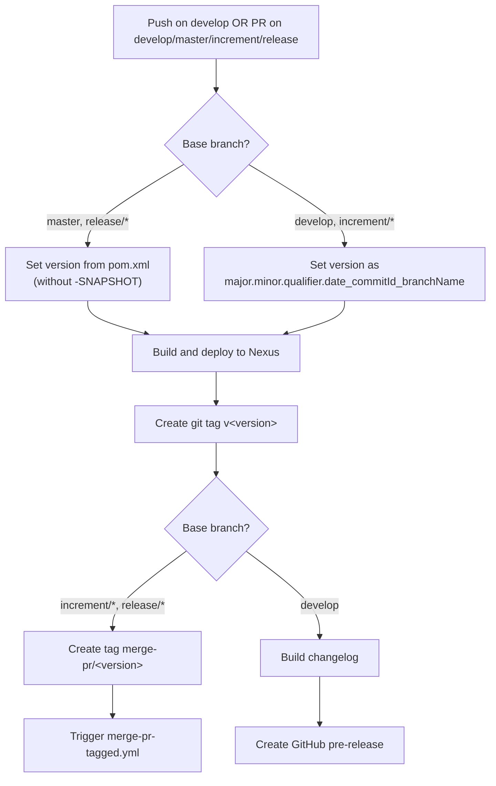
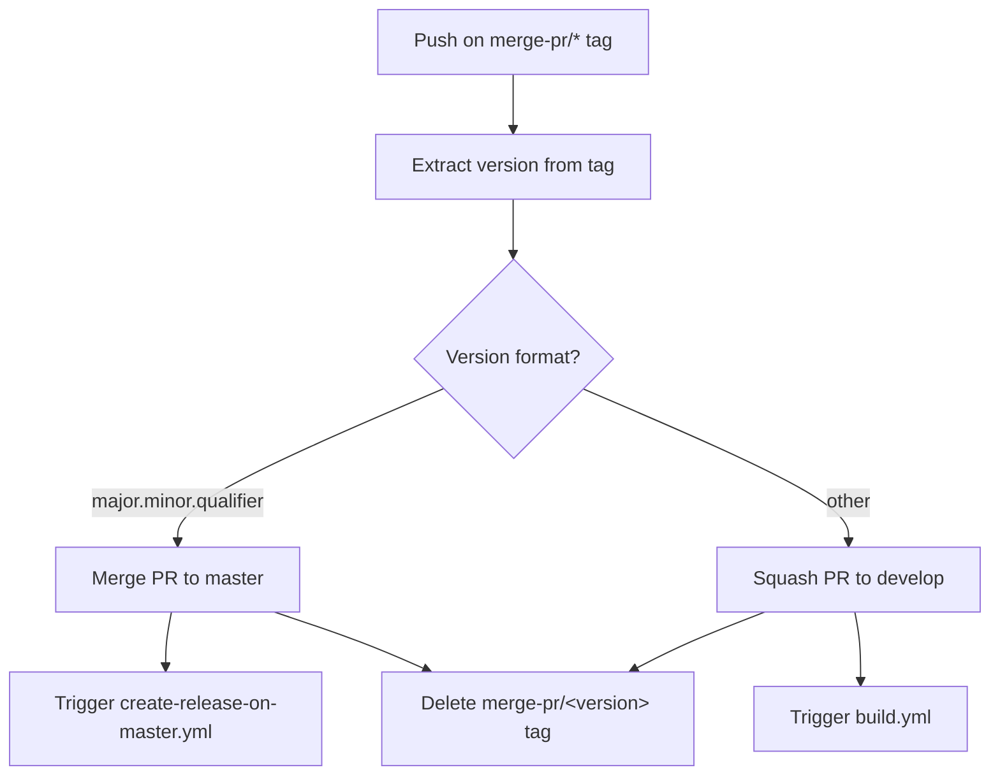
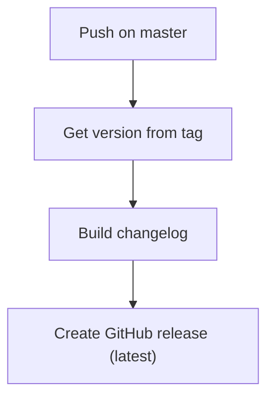
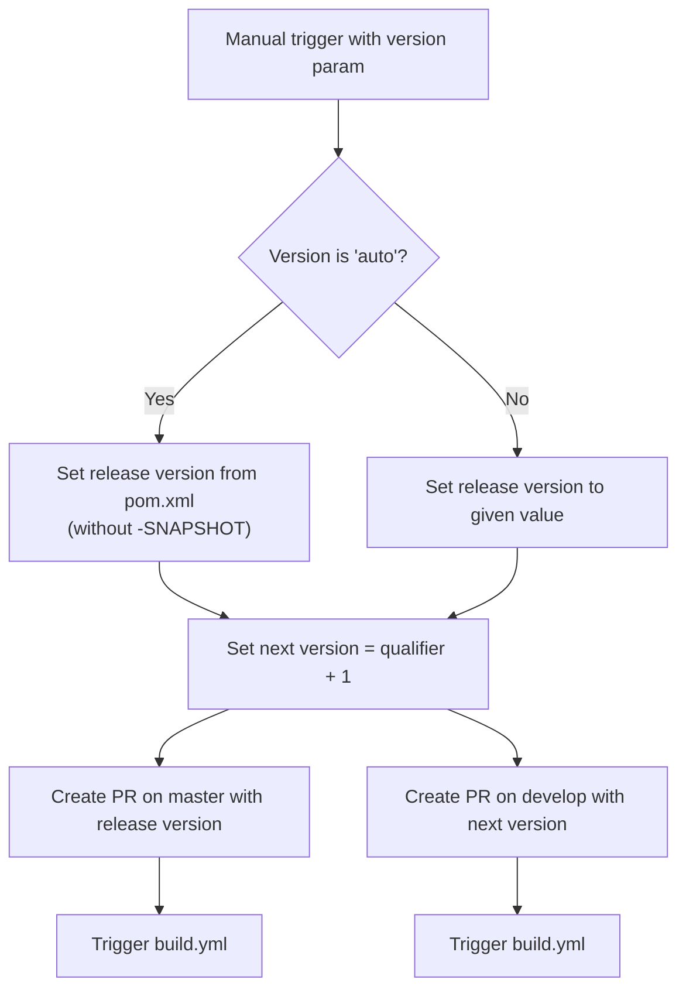

# Development Version and Branch Handling

## Branches

The versioning policy for JUDO NG modules is based on [GitFlow](https://www.atlassian.com/git/tutorials/comparing-workflows/gitflow-workflow).

| Branch Pattern | Purpose |
|----------------|---------|
| `develop` | Latest development sources of the current active version |
| `feature/JNG-NUMBER_short_summary` | New features based on `develop` |
| `(release/)X_Y_betaN` | Release branches (`release/` prefix reserved for CI) |
| `bugfix/JNG-NUMBER_short_summary` | Fixes based on release branches; must be applied to all newer versions |
| `support/JNG-NUMBER_short_summary` | Support branches based on release branches |
| `master` | Latest released sources of the current active version |

```mermaid
gitGraph
    commit id: "initial"
    branch develop
    checkout develop
    commit id: "dev-1"
    branch feature/JNG-1
    commit id: "feat-1a"
    commit id: "feat-1b"
    checkout develop
    merge feature/JNG-1 id: "merge-feat-1"
    branch feature/JNG-3
    commit id: "feat-3a"
    checkout develop
    merge feature/JNG-3 id: "merge-feat-3"
    branch release/1.0-beta1
    commit id: "rc-1"
    branch bugfix/JNG-4
    commit id: "bugfix-4"
    checkout release/1.0-beta1
    merge bugfix/JNG-4 id: "merge-bugfix"
    checkout develop
    merge release/1.0-beta1 id: "merge-release"
    checkout master
    merge release/1.0-beta1 id: "v1.0-beta1" tag: "v1.0-beta1"
```

## Version Numbers

Version numbers follow semantic versioning with these rules:

| Event | Version Change |
|-------|---------------|
| Starting a `feature/` branch | No version change |
| Starting a release branch from `develop` | 2nd number incremented on `develop` |
| Starting a `bugfix/` branch | No version change (applied on release branches before merge to master) |
| Starting a `support/` branch | 3rd number incremented |
| Starting a `hotfix/` branch | 4th number incremented (applied to both release and master) |

## GitHub Action Flows

### build.yml

This is the primary CI workflow that triggers on pushes to `develop` and pull requests targeting `develop`, `master`, `increment/*`, or `release/*` branches.



### merge-pr-tagged.yml

Triggered when a `merge-pr/*` tag is pushed. Routes the merge based on version format.



### create-release-on-master.yml

Triggered on pushes to `master`. Creates a GitHub release with a changelog.



### release.yml

Manually triggered workflow for creating releases.



## How to Develop

For issue tracking we use [JIRA](https://blackbelt.atlassian.net/jira/dashboards).

> **Important:** There is no commit without a ticket number. Every pull request and commit must include a `JNG-xxx` reference.
