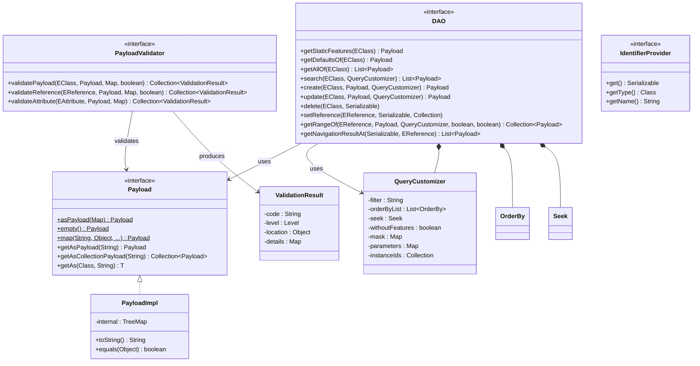

# JUDO DAO API

[](https://github.com/BlackBeltTechnology/judo-dao-api/actions/workflows/build.yml)

## Introduction

The JUDO DAO API defines the core Data Access Object interfaces used throughout the JUDO ecosystem's SDKs and APIs. This module provides the contract for all CRUD operations, querying, navigation, validation, and reference management on transfer objects backed by EMF (Eclipse Modeling Framework) metamodels.

This is a **pure API module** — it contains interfaces and a lightweight `Payload` implementation but no persistence logic. Concrete implementations are provided by downstream JUDO runtime modules.

## Context

This project is a building block of the [judo-community](https://github.com/BlackBeltTechnology/judo-community) aggregator project. See that repository for how this module fits into the broader JUDO ecosystem.

## Architecture

The module lives in a single Java package (`hu.blackbelt.judo.dao.api`) and exposes the following key types:



### Key Design Decisions

- **EMF-typed parameters** — All DAO methods accept EMF metaclass types (`EClass`, `EReference`, `EAttribute`) rather than Java classes, enabling model-driven operation dispatch.
- **Payload as Map** — `Payload` extends `Map<String, Object>`, making it a flexible, schema-less data carrier. Nested maps and collections are automatically wrapped as `Payload` instances on construction.
- **Transient fields** — Keys prefixed with `__$` are treated as transient metadata and excluded from equality checks.
- **TreeMap ordering** — `PayloadImpl` uses `TreeMap` internally to guarantee consistent key ordering.

## Build

```bash
./mvnw clean install          # Full build
./mvnw clean test             # Tests only
./mvnw test -Dtest=PayloadImplTest#testMethodName  # Single test method
```

## Contributing

See [CONTRIBUTING.md](CONTRIBUTING.md) for development environment setup, submission guidelines, and build commands.

## License

[Eclipse Public License 2.0](https://www.eclipse.org/legal/epl-2.0/)
